`App ID`和证书的 生成/配置
===============================================

<!-- START doctoc generated TOC please keep comment here to allow auto update -->
<!-- DON'T EDIT THIS SECTION, INSTEAD RE-RUN doctoc TO UPDATE -->

- [A. 创建`App ID`](#a-%E5%88%9B%E5%BB%BAapp-id)
  - [1. 导航进入创建`App ID`页面](#1-%E5%AF%BC%E8%88%AA%E8%BF%9B%E5%85%A5%E5%88%9B%E5%BB%BAapp-id%E9%A1%B5%E9%9D%A2)
  - [2. 配置`App ID`](#2-%E9%85%8D%E7%BD%AEapp-id)
  - [3. 确认并完成`App ID`的配置](#3-%E7%A1%AE%E8%AE%A4%E5%B9%B6%E5%AE%8C%E6%88%90app-id%E7%9A%84%E9%85%8D%E7%BD%AE)
- [B. 创建证书](#b-%E5%88%9B%E5%BB%BA%E8%AF%81%E4%B9%A6)
  - [1. 导航进入创建证书页面](#1-%E5%AF%BC%E8%88%AA%E8%BF%9B%E5%85%A5%E5%88%9B%E5%BB%BA%E8%AF%81%E4%B9%A6%E9%A1%B5%E9%9D%A2)
  - [2. 选择开发证书的类型](#2-%E9%80%89%E6%8B%A9%E5%BC%80%E5%8F%91%E8%AF%81%E4%B9%A6%E7%9A%84%E7%B1%BB%E5%9E%8B)
  - [3. 选择开发证书 关联的`App ID` :link:](#3-%E9%80%89%E6%8B%A9%E5%BC%80%E5%8F%91%E8%AF%81%E4%B9%A6-%E5%85%B3%E8%81%94%E7%9A%84app-id-link)
  - [4. 生成 证书签名请求文件](#4-%E7%94%9F%E6%88%90-%E8%AF%81%E4%B9%A6%E7%AD%BE%E5%90%8D%E8%AF%B7%E6%B1%82%E6%96%87%E4%BB%B6)
  - [5. 上传 证书签名请求文件](#5-%E4%B8%8A%E4%BC%A0-%E8%AF%81%E4%B9%A6%E7%AD%BE%E5%90%8D%E8%AF%B7%E6%B1%82%E6%96%87%E4%BB%B6)
  - [6. 完成开发证书生成/下载并添加到本地的钥匙串](#6-%E5%AE%8C%E6%88%90%E5%BC%80%E5%8F%91%E8%AF%81%E4%B9%A6%E7%94%9F%E6%88%90%E4%B8%8B%E8%BD%BD%E5%B9%B6%E6%B7%BB%E5%8A%A0%E5%88%B0%E6%9C%AC%E5%9C%B0%E7%9A%84%E9%92%A5%E5%8C%99%E4%B8%B2)
- [C. 创建`Provisioning Profiles`](#c-%E5%88%9B%E5%BB%BAprovisioning-profiles)
  - [1. 导航进入创建`Provisioning Profiles`页面](#1-%E5%AF%BC%E8%88%AA%E8%BF%9B%E5%85%A5%E5%88%9B%E5%BB%BAprovisioning-profiles%E9%A1%B5%E9%9D%A2)
- [C. 配置推送证书](#c-%E9%85%8D%E7%BD%AE%E6%8E%A8%E9%80%81%E8%AF%81%E4%B9%A6)
  - [1. 配置`Push SSL Certificate`](#1-%E9%85%8D%E7%BD%AEpush-ssl-certificate)
- [参考资料](#%E5%8F%82%E8%80%83%E8%B5%84%E6%96%99)

<!-- END doctoc generated TOC please keep comment here to allow auto update -->

## A. 创建`App ID`

### 1. 导航进入创建`App ID`页面

- :vertical_traffic_light: 在你的开发者账号，点击【App IDs】链接。
- :vertical_traffic_light: 在打开的页面再点【+】，进入创建`App ID`页面

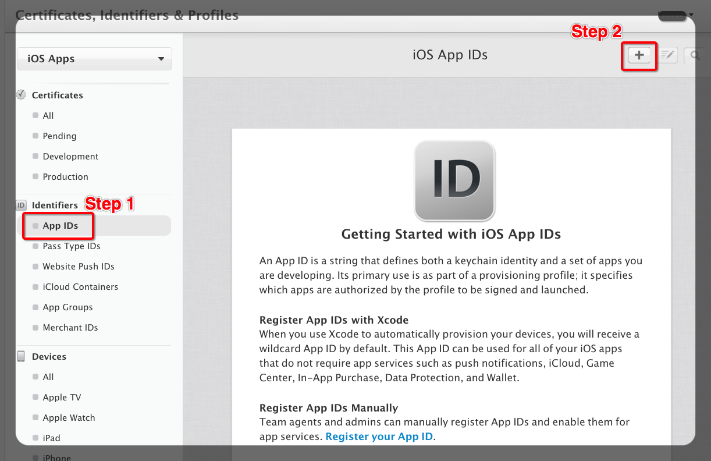

如果这是 **第一个** 创建的`App ID`，界面上会有下面的文字说明（可以通过[这个链接](https://developer.apple.com/account/ios/identifiers/bundle/bundleLanding.action)直接访问这个说明界面），否则界面上是`App ID`的列表信息（可以通过[这个链接](https://developer.apple.com/account/ios/identifiers/bundle/bundleList.action)直接访问这个列表界面）。

> An App ID is a string that defines both a keychain identity and a set of apps you are developing. Its primary use is as part of a provisioning profile; it specifies which apps are authorized by the profile to be signed and launched.
> 
> Register App IDs with Xcode
When you use Xcode to automatically provision your devices, you will receive a wildcard App ID by default. This App ID can be used for all of your iOS apps that do not require app services such as push notifications, iCloud, Game Center, In-App Purchase, Data Protection, and Wallet.

总结一下上面说明：

1. `App ID`定义：
     - 一个`KeyChain`的`identity`，即`App Name`（后面会说到）。
     - 一组`App`，`App ID`包含了通配符`wildcard`（`App ID`后面会说到），即是一个`wildcard App ID`。  
        \# 一组`App`当然可以只包含一个，即不是一个`wildcard App ID`。
1. `App ID`主要用作 `provisioning profile`组成部分（`provisioning profile`后面会说到），`App ID`指定了 哪个应用 可以用该`provisioning profile`来签名并启动运行。
1. 在`Xcode`中登陆开发者账号时并运行一个应用时，`Xcode`会自动创建一个`wildcard App ID`。
1. `wildcard App ID` **_不能_** 用于 使用了`App`服务的`iOS App` :heavy_exclamation_mark:   
    比如`push notifications`、`iCloud`、`Game Center`、`In-App Purchase`、`Data Protection`、`Wallet`等等。  
    这点要注意，对于我们现在要实现推送Demo应用，使用了『推送服务』，显然是不能用一个`wildcard App ID`的。

### 2. 配置`App ID`

- :vertical_traffic_light: 填写`App Name`： `PushHelloDemo`
- :vertical_traffic_light: 选择【`Explicit App ID`】，填写`Bundle ID`： `com.foo.PushHelloDemo`  
    PS： `AppName` 和 `App ID` 和开发者账号相关，即不同的开发者账号用相同值 是**不会冲突**的。走这个Demo时，你可以直接配置上面值，省得自己想一个不同名字，在看后面的内容时记乱了 :smile_cat:

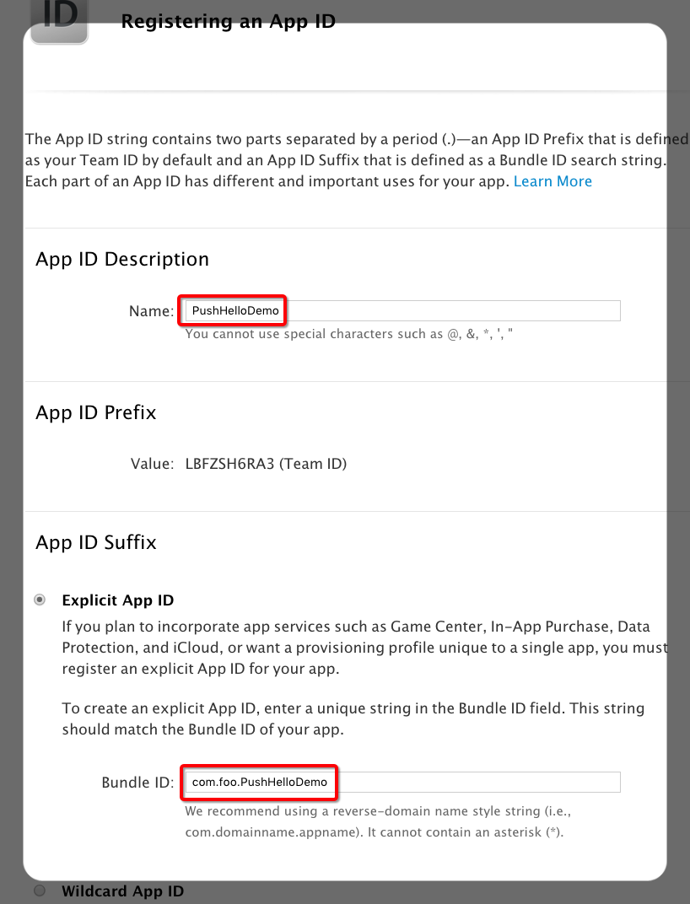

- :vertical_traffic_light: 【`App Services`】中勾上【`Push Notifications`】，即启用应用的推送服务。
- :vertical_traffic_light: 点击【Continue】，进入确认页

### 3. 确认并完成`App ID`的配置

- :vertical_traffic_light: 确认【`Push Notifications`】是处于`Configurable`的。
- :vertical_traffic_light: 点击【Submit】完成 `App ID`的创建。 :two_hearts: :sparkles:

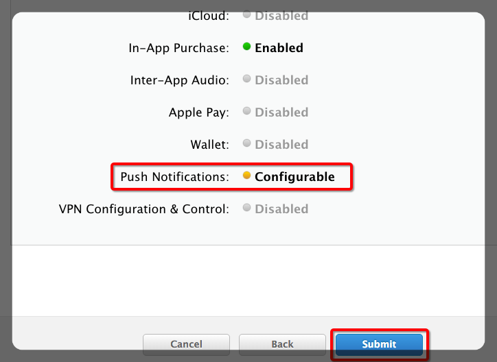

后面你再进入`App ID`页的[导航页]((https://developer.apple.com/account/ios/identifiers/bundle/bundleList.action))，`App ID`列表已经有这个新建的了。

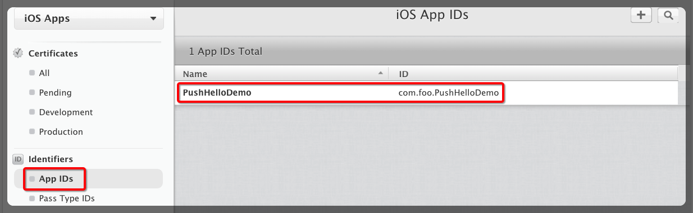

## B. 创建证书

证书（`Certificates`）分成 开发证书（`Development Certificate`） 和 生产证书（`Production Certificate`）。下面以 开发证书 为例说明 流程。  
\# 因为Demo运行要的是『开发证书』。另外，整体过程清楚了，生产证书的 有差别的地方，看看页面也比较容易明白。

### 1. 导航进入创建证书页面

- :vertical_traffic_light: 在你的开发者账号，点击【Certificates】下【Development】链接。
- :vertical_traffic_light: 在打开的页面再点【+】，进入创建 开发证书 页面。

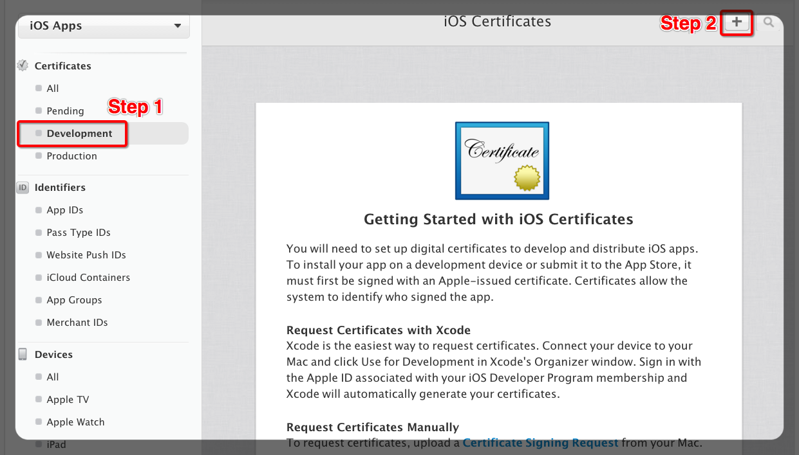

如果这是 **第一个** 创建的开发证书，界面上会有下面的文字说明（可以通过[这个链接](https://developer.apple.com/account/ios/certificate/certificateLanding.action?type=development)直接访问这个说明界面），否则界面上是 开发证书的列表信息（可以通过[这个链接](https://developer.apple.com/account/ios/certificate/certificateList.action?type=development)直接访问这个列表界面）。

> You will need to set up digital certificates to develop and distribute iOS apps. To install your app on a development device or submit it to the App Store, it must first be signed with an Apple-issued certificate. Certificates allow the system to identify who signed the app.
>
> Request Certificates with Xcode
Xcode is the easiest way to request certificates. Connect your device to your Mac and click Use for Development in Xcode's Organizer window. Sign in with the Apple ID associated with your iOS Developer Program membership and Xcode will automatically generate your certificates.

总结一下上面说明：

- 用苹果颁发的证书签名的`App`才可以 安装到开发设备上 或是 提交到`App Store`。
- 证书签名`App`，标识了应用是由哪个开发者账号开发的。
- 通过`Xcode`生成证书是最方便的方式：
    1. 设备连接上`Mac`，在`Xcode`的`Organizer`窗口中，点击把这个设备用做开发设备。
    1. 在`Xcode`中登录开发者账号，`Xcode`会自动生成证书。

但对于要使用的推送服务`App`，不能用这个`Xcode`自动生成的开发证书 :heavy_exclamation_mark:  
所以我们接着走下面的证书生成的流程。

### 2. 选择开发证书的类型

- :vertical_traffic_light: 选中【`Apple Push Notification service SSL (Sandbox)`】
- :vertical_traffic_light: 滚动页面到最下面，点击【Continue】，进入下一步

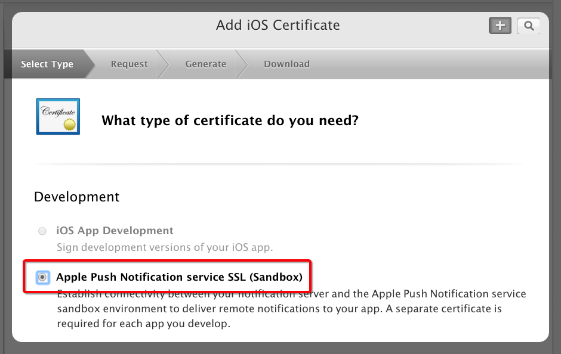

### 3. 选择开发证书 关联的`App ID` :link:

- :vertical_traffic_light: `App ID`选中【`com.foo.PushHelloDemo`】
- :vertical_traffic_light: 点再【Continue】，进入下一步

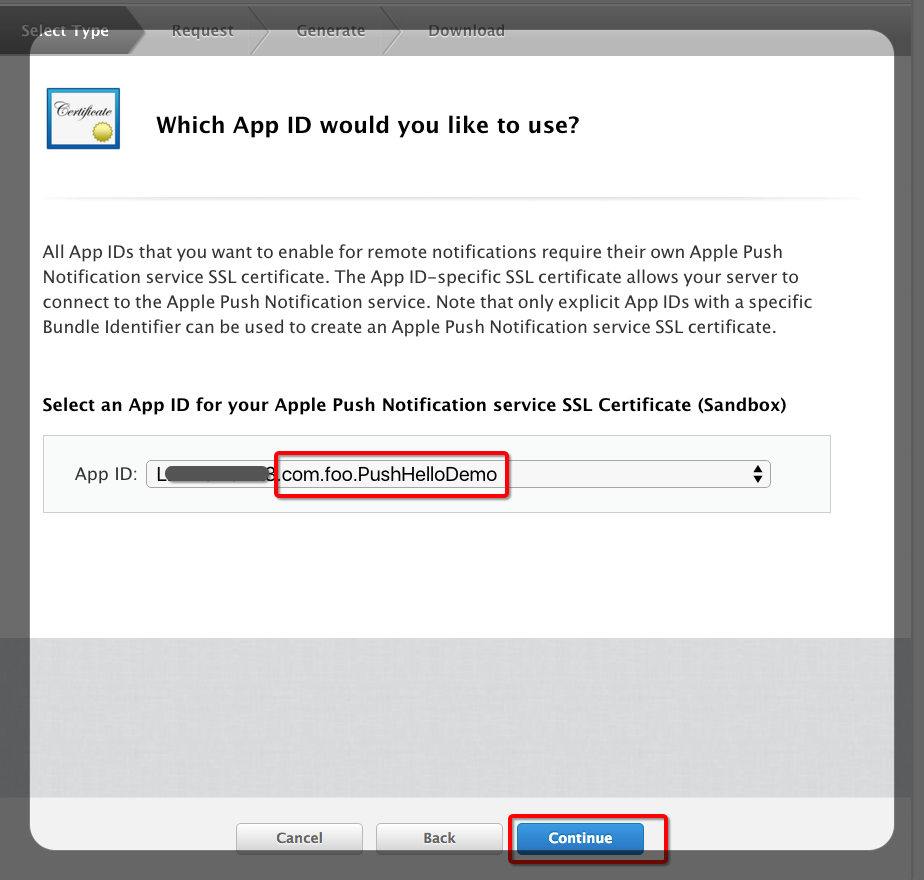

### 4. 生成 证书签名请求文件

- :vertical_traffic_light: 进入『生成 证书签名请求文件（`Certificate Signing Request/CSR`）』页面。  
    页面文字说明了生成方法。

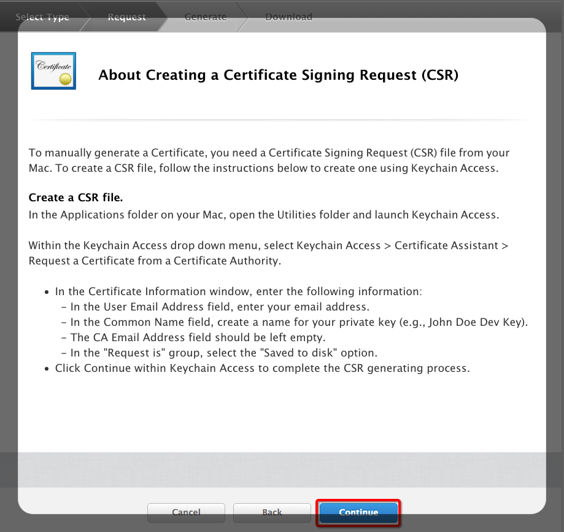

下面是 证书签名请求文件的生成具体操作说明：

- :vertical_traffic_light: 打开『钥匙串访问』应用。
- :vertical_traffic_light: 点再 【主菜单】- 【证书助理】 - 【从证书颁发机构请求证书……】  
    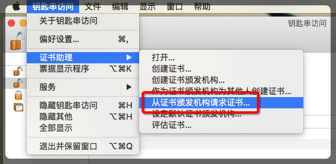
- :vertical_traffic_light: 在弹出窗口中，填写：   
    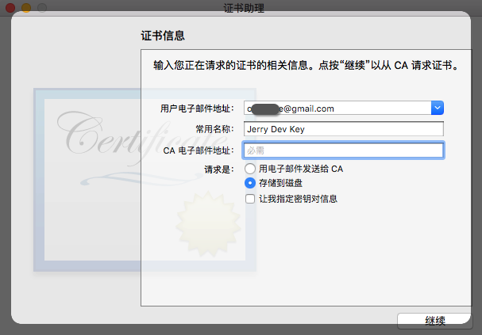
    1. 用户电邮地址： 填写的你电邮地址（随便写一个也没有关系:）
    1. 常用名称：是私钥的名字，可以填 『Jerry Dev Key』（随便写一个也没有关系:）
    1. `CA`电邮地址： 留空不填。
    1. 选择【存储到磁盘】
- :vertical_traffic_light: 点击【继续】，保存证书请求文件到本地，缺省文件名是 `CertificateSigningRequest.certSigningRequest`。

- :vertical_traffic_light: 通过『钥匙串访问』生成`CertificateSigningRequest.certSigningRequest`后，点击『生成 证书签名请求文件（`Certificate Signing Request/CSR`）』页面的【Continue】，进入下一步。

### 5. 上传 证书签名请求文件

- :vertical_traffic_light: 点击【`Choose File...`】选择上传本地的`CertificateSigningRequest.certSigningRequest`文件。
- :vertical_traffic_light: 点击【Generate】，进入下一步。

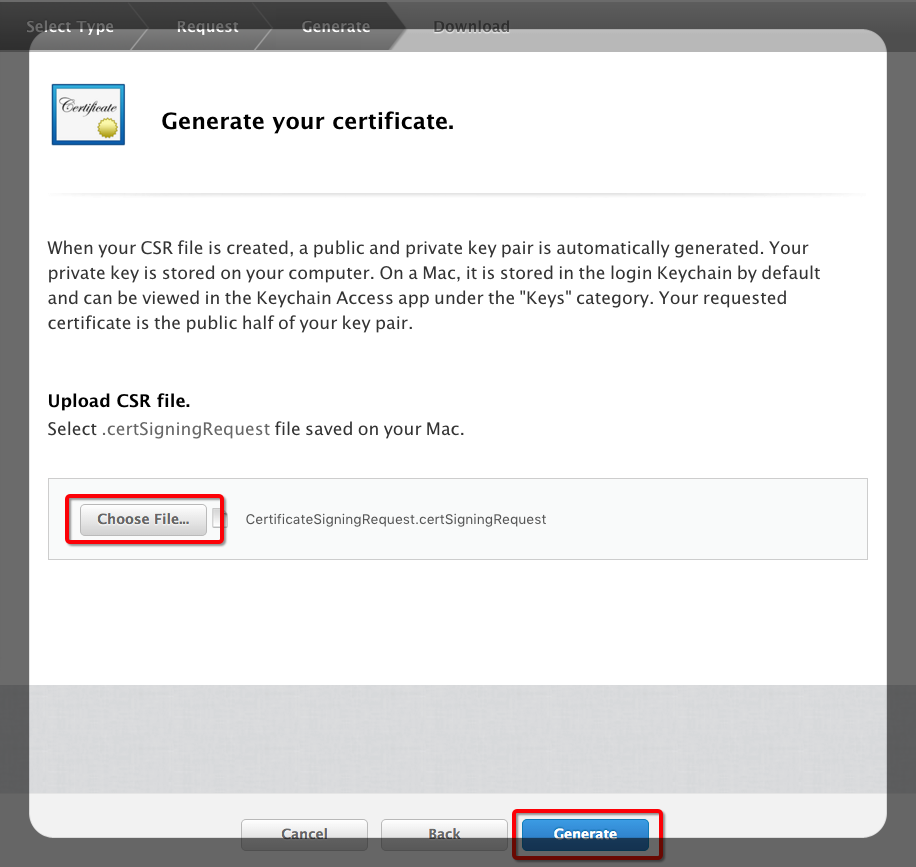

### 6. 完成开发证书生成/下载并添加到本地的钥匙串

- :vertical_traffic_light:  完成开发证书的配置了，点击【Download】下载 开发证书文件，文件名一般是`aps_development.cer`。
- :vertical_traffic_light:  双击下载的证书文件`aps_development.cer`，添加到『钥匙串访问』应用中。  :two_hearts: :sparkles:

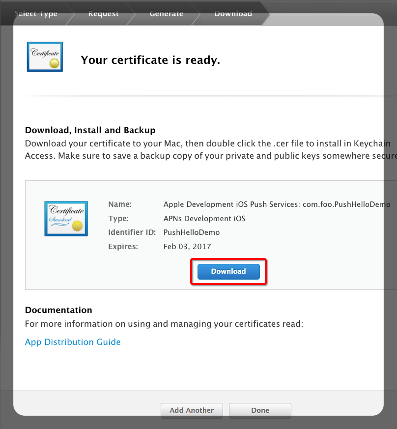

## C. 创建`Provisioning Profiles`

`Provisioning Profiles`分成 开发`Provisioning Profiles`（`Development Provisioning Profile`） 和 发布`Provisioning Profiles`（`Distribution Provisioning Profile`）。下面以 开发`Provisioning Profiles` 为例说明 流程。  
\# 因为Demo运行要的是『开发`Provisioning Profiles`』。另外，整体过程清楚了，发布`Provisioning Profiles`的 有差别的地方，看看页面也比较容易明白。

### 1. 导航进入创建`Provisioning Profiles`页面

- :vertical_traffic_light: 在你的开发者账号，点击【Provisioning Profiles】下【Development】链接。
- :vertical_traffic_light: 在打开的页面再点【+】，进入创建 `Provisioning Profiles` 页面。

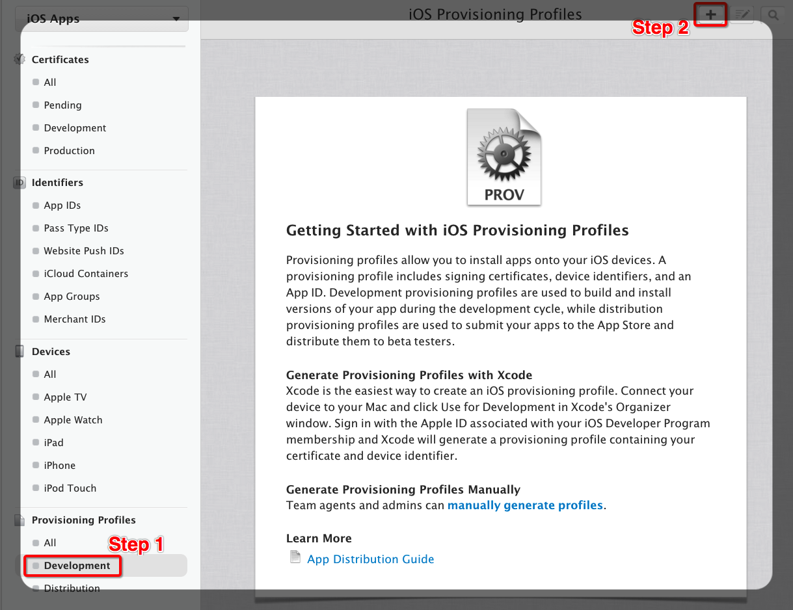

如果这是 **第一个** 创建的`Provisioning Profile`，界面上会有下面的文字说明（可以通过[这个链接](https://developer.apple.com/account/ios/profile/profileCreate.action)直接访问这个说明界面），否则界面上是 `Provisioning Profile`的列表信息（可以通过[这个链接](https://developer.apple.com/account/ios/certificate/certificateList.action?type=development)直接访问这个列表界面）。

> Provisioning profiles allow you to install apps onto your iOS devices. A provisioning profile includes signing certificates, device identifiers, and an App ID. Development provisioning profiles are used to build and install versions of your app during the development cycle, while distribution provisioning profiles are used to submit your apps to the App Store and distribute them to beta testers.
>
> Generate Provisioning Profiles with Xcode
Xcode is the easiest way to create an iOS provisioning profile. Connect your device to your Mac and click Use for Development in Xcode's Organizer window. Sign in with the Apple ID associated with your iOS Developer Program membership and Xcode will generate a provisioning profile containing your certificate and device identifier.

总结一下上面说明：

- `Provisioning Profile`用于安装`App`到`iOS`设置。
- `Provisioning Profile`包含了：
    1. 签名证书
    2. 可以安装上`App`的开发设备`ID`列表
    3. `App ID`
- 开发`Provisioning Profiles`（`Development Provisioning Profile`）  是在开发过程中，用于构建和安装应用到开发设备。
- 发布`Provisioning Profiles`（`Distribution Provisioning Profile`）是用于提交到`App`到`App Store`和发布应用到`Beta`测试（`beta testers`）。
- 通过`Xcode`生成`Provisioning Profile`是最方便的方式：
    1. 设备连接上`Mac`，在`Xcode`的`Organizer`窗口中，点击把这个设备用做开发设备。
    1. 在`Xcode`中登录开发者账号，`Xcode`会自动`Provisioning Profile`，这个`Provisioning Profile`包含了 你的证书和开发设备`ID`。

## C. 配置推送证书

### 1. 配置`Push SSL Certificate`

参考资料
----------------------------

- 已经有写的`iOS`推送的开发`Guide`
    - [iOS推送小结（证书的生成、客户端的开发、服务端的开发）](http://www.jianshu.com/p/51c540b403f6)
    - [一步一步实现iOS应用PUSH功能](http://tanqisen.github.io/blog/2013/02/27/ios-push-apns/)
- 关于开发者账号和证书
    - [苹果开发者账号那些事儿（一）](http://ryantang.me/blog/2013/08/28/apple-account-1/)
    - [苹果开发者账号那些事儿（二）](http://ryantang.me/blog/2013/09/03/apple-account-2/)
    - [苹果开发者账号那些事儿（三）](http://ryantang.me/blog/2013/11/28/apple-account-3/)
    - [iOS 证书 设置指南 - 极光推送文档](http://docs.jpush.cn/pages/viewpage.action?pageId=1343727#iOS证书设置指南-配置和下载证书)
- 官方文档，内容最详细完整
    - [App Distribution Quick Start](https://developer.apple.com/library/ios/documentation/IDEs/Conceptual/AppStoreDistributionTutorial/Introduction/Introduction.html#//apple_ref/doc/uid/TP40013839)
    - [App Distribution Guide](https://developer.apple.com/library/ios/documentation/IDEs/Conceptual/AppDistributionGuide/Introduction/Introduction.html#//apple_ref/doc/uid/TP40012582)

当安装好Xcode时，媒介证书（Intermediate Certificate）就已经安装到我们的钥匙串中去了。通过在开发者账号（Developer Account）和本地（Mac）都经过验证的证书（Certificate）我们就可以利用合法的证书进行App的测试和发布了。
